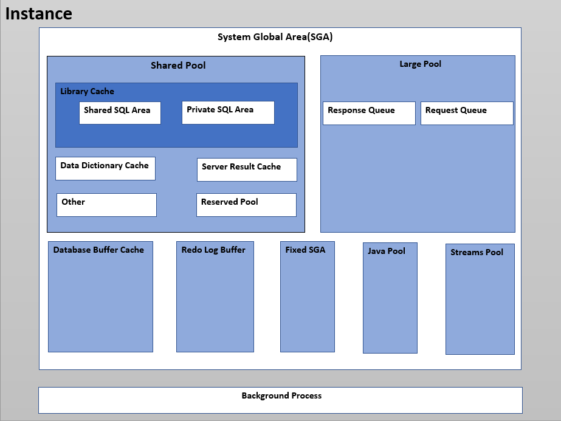

# 1.アーキテクチャの理解

## 1-2.内部構造とインスタンス

**データベース・インスタンス**は、データベース・ファイルを管理する一連のメモリー構造です。

データベースは、`CREATE DATABASE`文によって作成されたディスク上の一連の物理ファイルです。インスタンスは、関連データを管理し、データベースのユーザーに対応します。

稼働中のすべてのOracleデータベースは、1つ以上のOracleデータベース・インスタンスに関連付けられます。インスタンスはメモリー内に存在し、データベースはディスク上に存在するため、インスタンスがデータベースなしで存在することも、データベースがインスタンスなしで存在することも可能です

### データベースインスタンスの構造

インスタンスが起動されると、Oracle DatabaseによってSGA(System Global Area)にメモリー領域が割り当てられ、1以上のバックグラウンド・プロセスが起動されます。

SGAには、プロセス間で共有されるデータが保管されます。
SGAには、用途に応じたいくつかのメモリー領域があり、これを**コンポーネント**と呼ぶことがあります。

以下に主要コンポーネントを記載します。

|コンポーネント|説明|
|:--:|:--|
|データベースバッファキャッシュ|データファイルから読み込んだブロックをキャッシュする。また、変更されたブロックをデータファイルに書き出す前に一時的に保管する(バッファ機能)|
|Redoログバッファ|REDOログファイルに書き込む前にREDOデータ(変更履歴)を一時的に保管する|
|共有プール|解析済みのSQLやデータディクショナリの情報などをキャッシュする|
|Javaプール|Java言語で記述されたストアドプログラムの実行にしようされる|
|ラージプール|バックアップや並列処理などの作業領域として使用される|

下図に、Oracleデータベース・インスタンスの主要コンポーネントを示します。

